# ***Frontend-ToDo-App_Slack-Alerts-for-S3-Bucket-Changes***

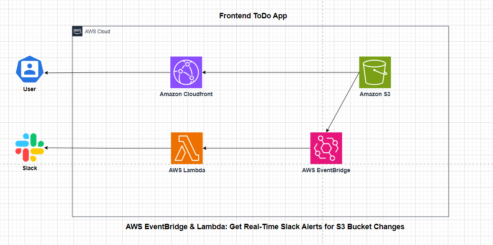


### ***Overview***

This AWS Lab focuses on deploying a frontend Todo application using AWS CloudFront and Amazon S3, while also implementing real-time Slack alerts for S3 bucket changes using AWS EventBridge and AWS Lambda.

### ***Prerequisites***

- Amazon Cloudfront
- Amazon S3
- AWS Lambda
- AWS Eventbridge
- Slack

### ***Key Components:***
Frontend Todo App Deployment: The application is a static frontend hosted on an Amazon S3 bucket. AWS CloudFront is used as a CDN to serve the application globally with low latency. The deployment follows best practices, including enabling versioning and configuring proper access controls. Real-Time Slack Alerts for S3 Changes:Amazon S3 events (e.g., file uploads, deletions) trigger alerts. AWS EventBridge captures these events and routes them to an AWS Lambda function. The Lambda function processes the event and sends real-time notifications to a specified Slack channel. This setup helps monitor changes in the S3 bucket effectively.

### ***Learning Outcomes:***

Deploying and managing a static frontend app using S3 and CloudFront. Setting up EventBridge rules to capture S3 events. Writing a Lambda function to send notifications to Slack. Understanding event-driven architecture and real-time monitoring in AWS.

This lab is ideal for those looking to gain hands-on experience with serverless applications, AWS event-driven workflows, and cloud-based monitoring solutions.


## ***Part 1***
### ***Step 1***


### ***Implementation***

***Select a region***

Choose **US East (N. Virginia)** region.

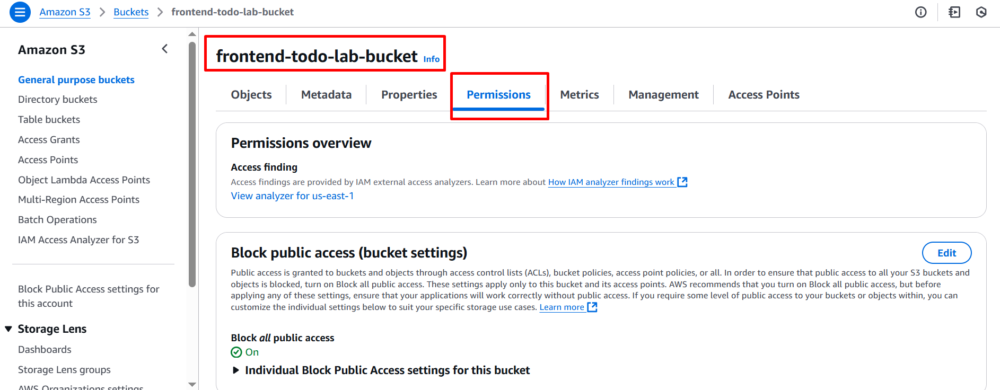


Go to ***Amazon S3***

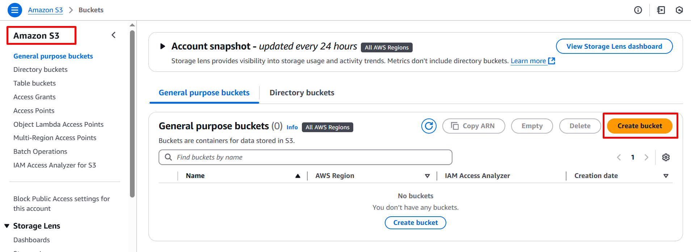

Bucket name: ***frontend-todo-lab-bucket***

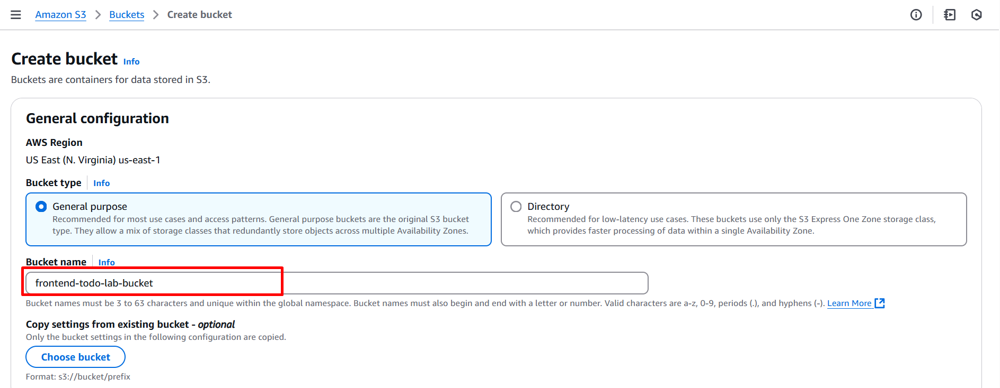

Click the create
Keep the default setting.


Go to cloudfront

Create cloudfront distribution
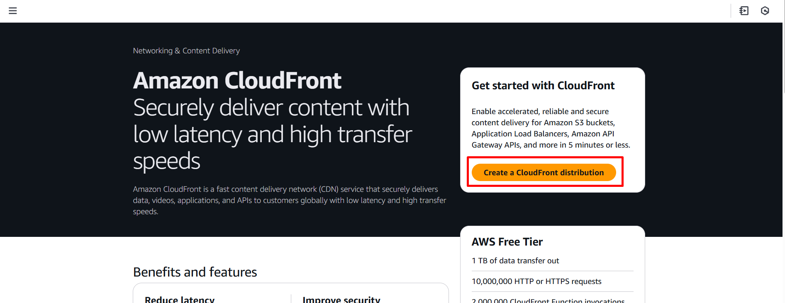

Distribution name: 
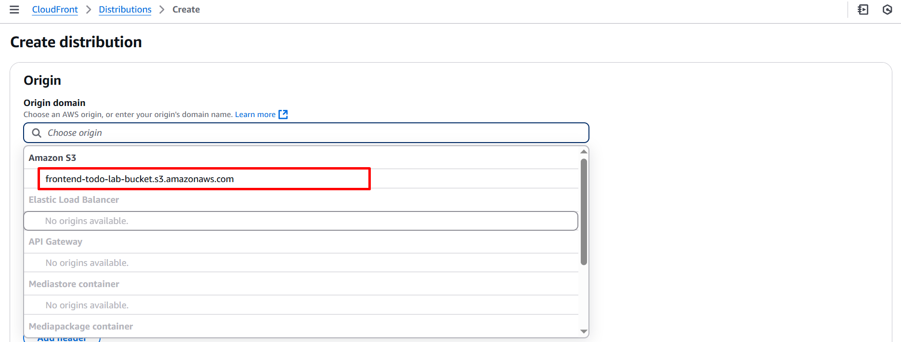

Choose origin access control settings

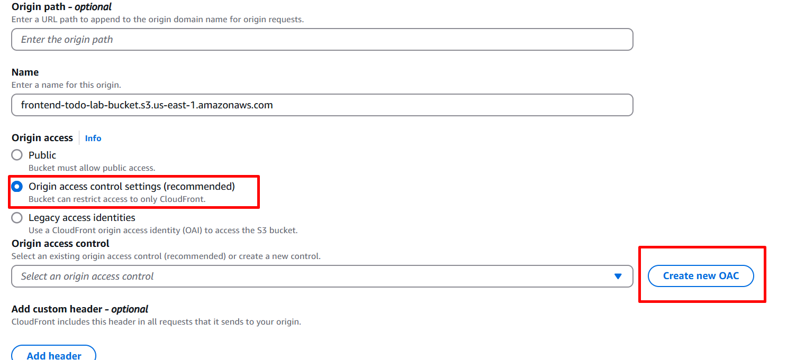

Create OAC

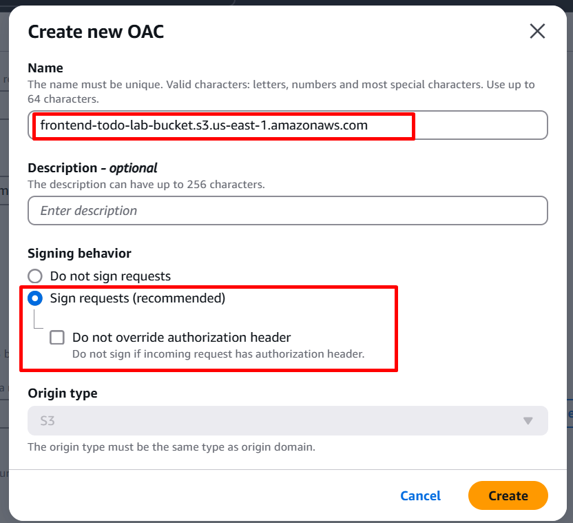


under Default cache behavior


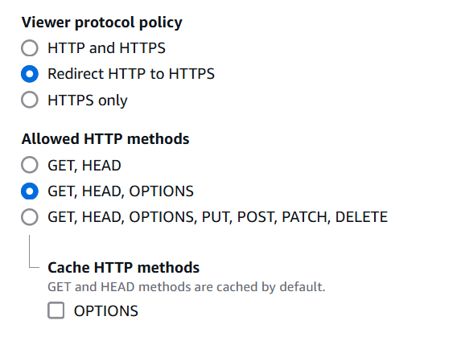


Check do not enable security protections

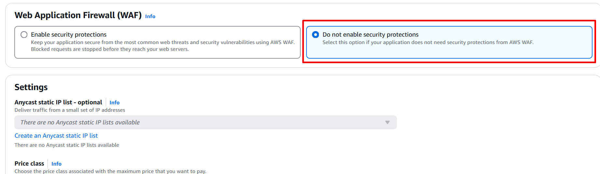

Choose price class as Use ***North America, Europe, Asia, Middle East, and Africa***

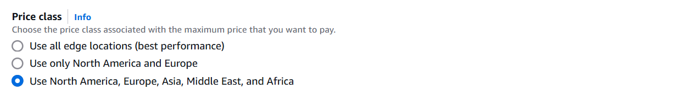

If have certificate, can add certificate. After that just keep as default and click create distribution

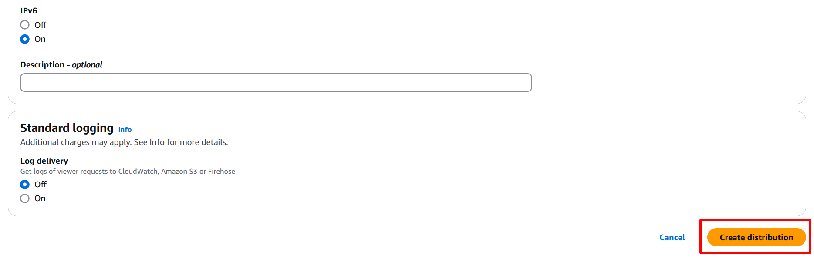

Check Cloudfront distribution and copy the S3 bucket policy.
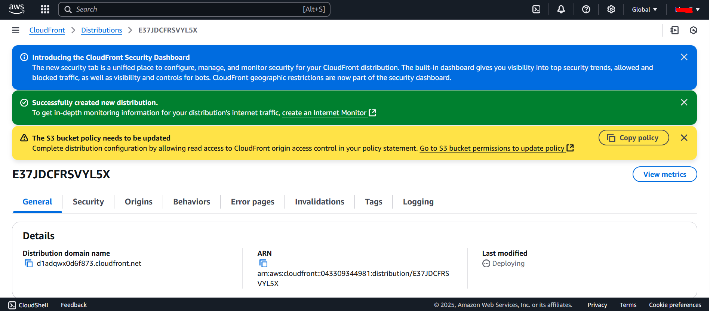

Go to Amazon S3 and add bucket which copy from Cloudfront distribution. (Go to bucket permission)


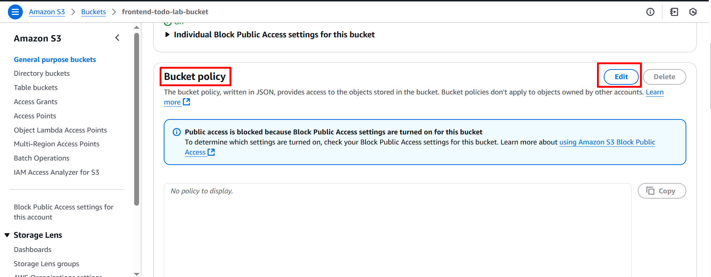

Please check bucket policy example as below;

```json
{
        "Version": "2008-10-17",
        "Id": "PolicyForCloudFrontPrivateContent",
        "Statement": [
            {
                "Sid": "AllowCloudFrontServicePrincipal",
                "Effect": "Allow",
                "Principal": {
                    "Service": "cloudfront.amazonaws.com"
                },
                "Action": "s3:GetObject",
                "Resource": "arn:aws:s3:::frontend-todo-lab-bucket/*",
                "Condition": {
                    "StringEquals": {
                      "AWS:SourceArn": "arn:aws:cloudfront::043309344981:distribution/E37JDCFRSVYL5X"
                    }
                }
            }
        ]
      }
```


Go to IAM and user need to add user permission.

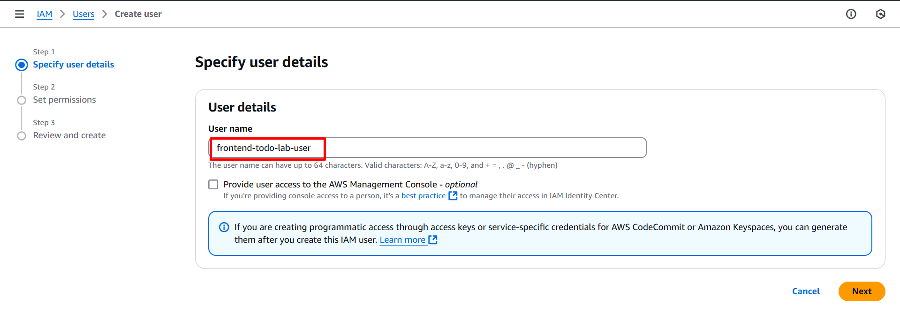


Go to Cloudfront distribution page and go to error page. Choose create error page.

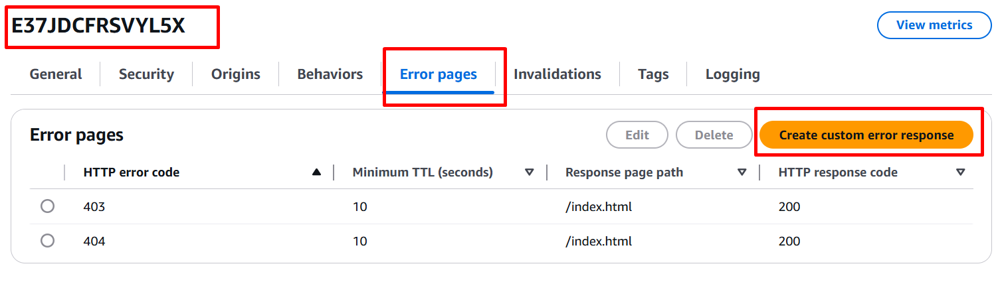


Update CloudFront Settings
Go to the AWS CloudFront Console.

Open your distribution (d1adqwx0d6f873.cloudfront.net).

Click Edit under the General settings.

Under Alternate domain name (CNAME), add:

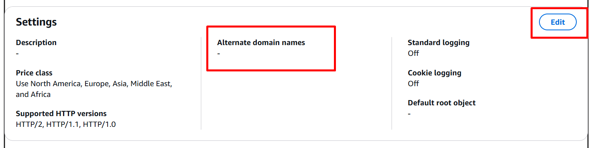


```bash
todo.kloudpro.store
```

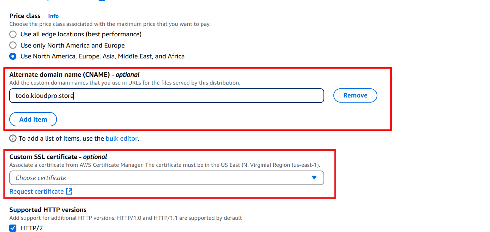

It may need to choose SSL certificate.

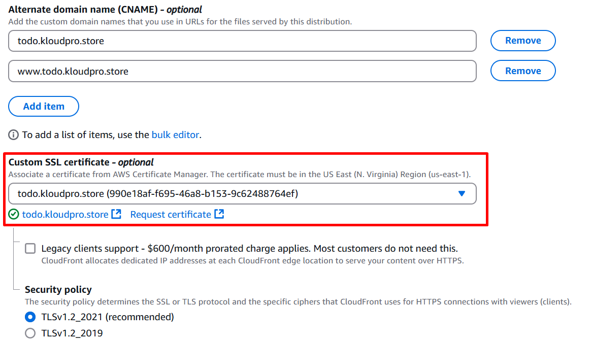

Just keep other setting as default.

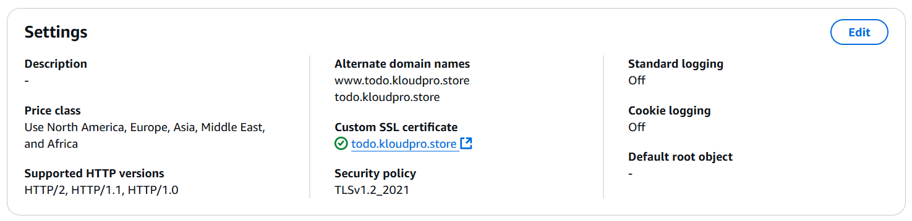

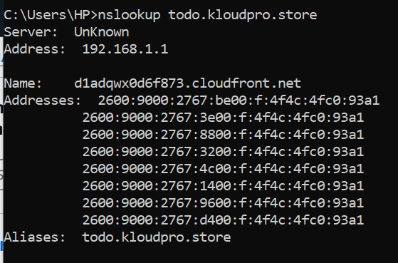

***Wait sometime to dns resolved.***

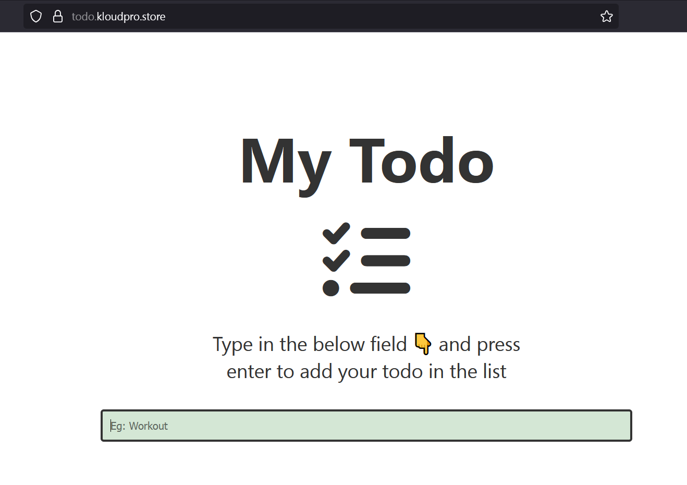

## ***Part 2***

This part configures AWS EventBridge to monitor S3 bucket changes (e.g., PutBucketAcl, PutBucketPublicAccessBlock), triggers a Lambda function to evaluate these changes, and sends notifications to a Slack channel if the bucket becomes public or its public access block is disabled.

### ***Prerequisites***

AWS CLI configured with permissions for S3, Lambda, EventBridge, IAM, and CloudTrail.
Slack webhook URL (e.g., https://hooks.slack.com/services/xxx/yyy/zzz).
S3 bucket frontend-todo-lab-bucket exists in us-east-1.
Python 3.9 and pip installed locally for packaging Lambda dependencies.

### ***Step 1: Set Up CloudTrail for S3 Events***
Purpose: EventBridge relies on CloudTrail to capture S3 API calls (e.g., PutBucketAcl). Configure a trail to log these events.

Action: Create an S3 Bucket for CloudTrail Logs:

```bash
aws s3api create-bucket \
    --bucket cloudtrail-logs-043309344981 \
    --region us-east-1
```

Apply a Bucket Policy: Create ***cloudtrail-bucket-policy.json***.

```json
{
    "Version": "2012-10-17",
    "Statement": [
        {
            "Sid": "AllowCloudTrailWrite",
            "Effect": "Allow",
            "Principal": {
                "Service": "cloudtrail.amazonaws.com"
            },
            "Action": "s3:PutObject",
            "Resource": "arn:aws:s3:::cloudtrail-logs-043309344981/AWSLogs/043309344981/*",
            "Condition": {
                "StringEquals": {
                    "s3:x-amz-acl": "bucket-owner-full-control"
                }
            }
        },
        {
            "Sid": "AllowCloudTrailGetBucketAcl",
            "Effect": "Allow",
            "Principal": {
                "Service": "cloudtrail.amazonaws.com"
            },
            "Action": "s3:GetBucketAcl",
            "Resource": "arn:aws:s3:::cloudtrail-logs-043309344981"
        }
    ]
}
```

Apply:

```bash
aws s3api put-bucket-policy \
    --bucket cloudtrail-logs-043309344981 \
    --policy file://cloudtrail-bucket-policy.json \
    --region us-east-1
```

Create the Trail:

```bash
aws cloudtrail create-trail \
    --name s3-events-trail \
    --s3-bucket-name cloudtrail-logs-043309344981 \
    --region us-east-1
```

Enable Management Events:
```bash
aws cloudtrail put-event-selectors \
    --trail-name s3-events-trail \
    --event-selectors '[{"ReadWriteType": "All", "IncludeManagementEvents": true, "DataResources": []}]' \
    --region us-east-1
```

Start Logging:
```bash
aws cloudtrail start-logging \
    --name s3-events-trail \
    --region us-east-1
```

Verify:
```bash
aws cloudtrail get-trail-status --name s3-events-trail --region us-east-1
```

Ensure "IsLogging": true.

### ***Step 2: Create an IAM Role for EventBridge***

Purpose: Create a role (EventBridgeExecutionRole) allowing EventBridge to invoke Lambda.


Create Trust Policy: Create ***eventbridge-trust-policy.json***

```json
{
    "Version": "2012-10-17",
    "Statement": [
        {
            "Effect": "Allow",
            "Principal": {
                "Service": "events.amazonaws.com"
            },
            "Action": "sts:AssumeRole"
        }
    ]
}
```

Create the role:

```bash
aws iam create-role \
    --role-name EventBridgeExecutionRole \
    --assume-role-policy-document file://eventbridge-trust-policy.json
```

Attach Permissions: Create ***eventbridge-policy.json***

```json
{
    "Version": "2012-10-17",
    "Statement": [
        {
            "Effect": "Allow",
            "Action": "lambda:InvokeFunction",
            "Resource": "arn:aws:lambda:us-east-1:043309344981:function:DetectPublicS3Changes"
        }
    ]
}
```

Apply:


```bash
aws iam put-role-policy \
    --role-name EventBridgeExecutionRole \
    --policy-name EventBridgeInvokeLambdaPolicy \
    --policy-document file://eventbridge-policy.json
```

Verify:

```bash
aws iam get-role --role-name EventBridgeExecutionRole
```


### ***Step 3: Create an EventBridge Rule***
Purpose: Capture S3 API calls (e.g., PutBucketAcl, PutBucketPublicAccessBlock) and trigger a Lambda function.
Create the rule:

```bash
aws events put-rule \
    --name DetectPublicS3Changes \
    --event-pattern '{
      "source": ["aws.s3"],
      "detail-type": ["AWS API Call via CloudTrail"],
      "detail": {
        "eventSource": ["s3.amazonaws.com"],
        "eventName": [
          "CreateBucket",
          "PutBucketAcl",
          "PutBucketPublicAccessBlock",
          "PutBucketPolicy"
        ]
      }
    }' \
    --role-arn arn:aws:iam::043309344981:role/EventBridgeExecutionRole \
    --region us-east-1
```

Verify:

```bash
aws events describe-rule --name DetectPublicS3Changes --region us-east-1
```

### ***Step 4: Create an IAM Role for Lambda***
Purpose: Create a role (LambdaS3MonitorRole) for the Lambda function with S3 and CloudWatch permissions.

Create Trust Policy: ***Create lambda-trust-policy.json***

```json
{
    "Version": "2012-10-17",
    "Statement": [
        {
            "Effect": "Allow",
            "Principal": {
                "Service": "lambda.amazonaws.com"
            },
            "Action": "sts:AssumeRole"
        }
    ]
}
```

Create the role:

```bash
aws iam create-role \
    --role-name LambdaS3MonitorRole \
    --assume-role-policy-document file://lambda-trust-policy.json
```

Attach S3 Permissions: Create ***lambda-s3-policy.json***

```json
{
    "Version": "2012-10-17",
    "Statement": [
        {
            "Effect": "Allow",
            "Action": [
                "s3:GetBucketAcl",
                "s3:ListBucket",
                "s3:GetBucketPublicAccessBlock"
            ],
            "Resource": "arn:aws:s3:::frontend-todo-lab-bucket"
        }
    ]
}
```

Apply:

```bash
aws iam put-role-policy \
    --role-name LambdaS3MonitorRole \
    --policy-name S3MonitorPolicy \
    --policy-document file://lambda-s3-policy.json
```

Attach CloudWatch Logs Permissions:

```bash
aws iam attach-role-policy \
    --role-name LambdaS3MonitorRole \
    --policy-arn arn:aws:iam::aws:policy/CloudWatchLogsFullAccess
```


Verify:
```bash
aws iam get-role --role-name LambdaS3MonitorRole
```

### ***Step 5: Create the Lambda Function***
Purpose: Create a Lambda function (DetectPublicS3Changes) to process S3 events and send Slack notifications.

Set Up Local Environment:

```bash
mkdir lambda-deployment
cd lambda-deployment
```

Install Dependencies:
Install requests with a compatible urllib3 for boto3

```bash
pip install requests urllib3==1.26.18 -t .
```

Create Function Code: Create ***lambda_function.py***

```python
import json
import boto3
import requests
from botocore.exceptions import ClientError
import os

# Load Slack webhook from environment variables
SLACK_WEBHOOK_URL = os.environ.get("SLACK_WEBHOOK_URL")

def lambda_handler(event, context):
    s3 = boto3.client('s3')
    event_name = event['detail']['eventName']
    bucket_name = event['detail']['requestParameters'].get('bucketName', '')
    region = event['region']
    user_identity = event['detail'].get('userIdentity', {}).get('arn', 'Unknown User')

    if not bucket_name:
        return

    # Check if bucket is public
    if event_name == "PutBucketAcl":
        if check_if_bucket_is_public(s3, bucket_name):
            message = f"🚨 S3 bucket `{bucket_name}` has a public ACL!\nRegion: {region}\nCreated by: {user_identity}"
            send_slack_notification(message)

    # Check if public access block was disabled
    elif event_name == "PutBucketPublicAccessBlock":
        if check_if_public_access_block_disabled(s3, bucket_name):
            message = f"🚨 Public access block disabled for `{bucket_name}`!\nRegion: {region}\nModified by: {user_identity}"
            send_slack_notification(message)

def check_if_bucket_is_public(s3, bucket_name):
    try:
        acl = s3.get_bucket_acl(Bucket=bucket_name)
        for grant in acl['Grants']:
            if grant['Grantee'].get('URI') == "http://acs.amazonaws.com/groups/global/AllUsers":
                return True
        return False
    except ClientError as e:
        print(f"Error checking ACL: {e}")
        return False

def check_if_public_access_block_disabled(s3, bucket_name):
    try:
        response = s3.get_public_access_block(Bucket=bucket_name)
        settings = response['PublicAccessBlockConfiguration']
        return not (settings['BlockPublicAcls'] and settings['IgnorePublicAcls'] and settings['BlockPublicPolicy'] and settings['RestrictPublicBuckets'])
    except ClientError as e:
        return e.response['Error']['Code'] == 'NoSuchPublicAccessBlockConfiguration'

def send_slack_notification(message):
    if not SLACK_WEBHOOK_URL:
        print("Slack webhook URL is not configured.")
        return
    try:
        response = requests.post(SLACK_WEBHOOK_URL, json={'text': message}, headers={'Content-Type': 'application/json'})
        response.raise_for_status()
    except requests.RequestException as e:
        print(f"Failed to send Slack notification: {e}")
```


Package the Code:

```bash
zip -r function.zip .
```

Create the Lambda Function:
```bash
aws lambda create-function \
    --function-name DetectPublicS3Changes \
    --runtime python3.9 \
    --role arn:aws:iam::043309344981:role/LambdaS3MonitorRole \
    --handler lambda_function.lambda_handler \
    --zip-file fileb://function.zip \
    --timeout 10 \
    --memory-size 128 \
    --environment Variables="{SLACK_WEBHOOK_URL=<YOUR_SLACK_WEBHOOK_URL>}" \
    --region us-east-1
```

Replace <ROLE_ARN> with the IAM Role ARN. And <YOUR_SLACK_WEBHOOK_URL> with the actual Slack Webhook URL.

Replace <YOUR_SLACK_WEBHOOK_URL> with your actual Slack webhook URL (e.g., https://hooks.slack.com/services/xxx/yyy/zzz).

Adding webhooks in slack api.

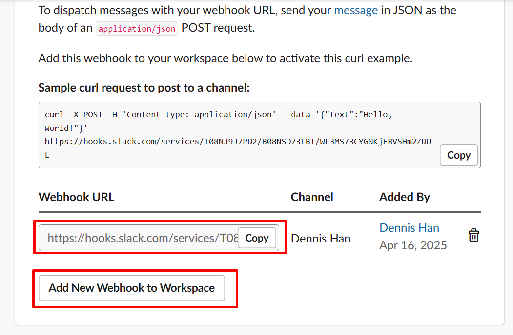

***Note: Please check in reference url***  
***https://www.svix.com/resources/guides/how-to-get-slack-webhook-url/***


Verify:

```bash
aws lambda get-function --function-name DetectPublicS3Changes --region us-east-1
```

### ***Step 6: Connect EventBridge to Lambda***

Purpose: Link the EventBridge rule to the Lambda function.

Add the Lambda as a target:

```bash
aws events put-targets \
    --rule DetectPublicS3Changes \
    --targets '[{"Id": "1", "Arn": "arn:aws:lambda:us-east-1:043309344981:function:DetectPublicS3Changes"}]' \
    --region us-east-1
```

Grant EventBridge permission to invoke Lambda:

```bash
aws lambda add-permission \
    --function-name DetectPublicS3Changes \
    --statement-id EventBridgeInvokePermission \
    --action lambda:InvokeFunction \
    --principal events.amazonaws.com \
    --source-arn arn:aws:events:us-east-1:043309344981:rule/DetectPublicS3Changes \
    --region us-east-1
```

Verify:
```bash
aws events list-targets-by-rule --rule DetectPublicS3Changes --region us-east-1
aws lambda get-policy --function-name DetectPublicS3Changes --region us-east-1
```

### Step 7: Configure the S3 Bucket for Testing
Purpose: Enable ACLs and disable BlockPublicAcls to allow PutBucketAcl testing.

Enable ACLs:
```bash
aws s3api put-bucket-ownership-controls \
    --bucket frontend-todo-lab-bucket \
    --ownership-controls '{"Rules": [{"ObjectOwnership": "BucketOwnerPreferred"}]}' \
    --region us-east-1
```

Disable BlockPublicAcls:

```bash
aws s3api put-public-access-block \
    --bucket frontend-todo-lab-bucket \
    --public-access-block-configuration '{"BlockPublicAcls": false, "IgnorePublicAcls": false, "BlockPublicPolicy": true, "RestrictPublicBuckets": true}' \
    --region us-east-1
```

Verify:
```bash
aws s3api get-bucket-ownership-controls --bucket frontend-todo-lab-bucket --region us-east-1
aws s3api get-public-access-block --bucket frontend-todo-lab-bucket --region us-east-1
```

### ***Step 8: Test the Setup***
Purpose: Trigger an S3 event to verify the EventBridge-Lambda-Slack pipeline.

Test PutBucketAcl:
```bash
aws s3api put-bucket-acl \
    --bucket frontend-todo-lab-bucket \
    --acl public-read \
    --region us-east-1
```

Check Slack:
Look for a notification (e.g., 🚨 S3 bucket frontend-todo-lab-bucket has a public ACL!).

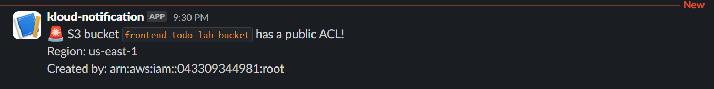

Check Logs:

```bash
aws logs tail /aws/lambda/DetectPublicS3Changes --region us-east-1
```
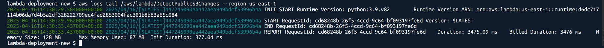


Test PutBucketPublicAccessBlock (alternative):

```bash
aws s3api put-public-access-block \
    --bucket frontend-todo-lab-bucket \
    --public-access-block-configuration '{"BlockPublicAcls": false, "IgnorePublicAcls": false, "BlockPublicPolicy": true, "RestrictPublicBuckets": true}' \
    --region us-east-1
```

Check Slack for 🚨 Public access block disabled for frontend-todo-lab-bucket!.

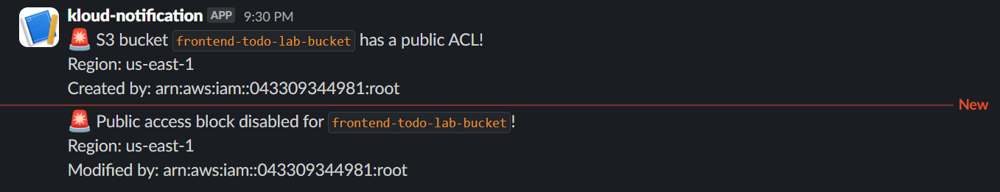

Troubleshooting:

No Notification:

Verify CloudTrail:

```bash
aws cloudtrail get-trail-status --name s3-events-trail --region us-east-1
```

Test Slack webhook:

```bash
curl -X POST -H 'Content-type: application/json' \
    --data '{"text":"Test message from curl"}' \
    <YOUR_SLACK_WEBHOOK_URL>
```

Test Lambda manually:

```bash
aws lambda invoke \
    --function-name DetectPublicS3Changes \
    --payload '{"detail-type": "AWS API Call via CloudTrail", "source": "aws.s3", "region": "us-east-1", "detail": {"eventSource": "s3.amazonaws.com", "eventName": "PutBucketAcl", "requestParameters": {"bucketName": "frontend-todo-lab-bucket"}, "userIdentity": {"arn": "arn:aws:iam::043309344981:user/test-user"}}}' \
    --region us-east-1 \
    output.json
```

## ***Step 9: Secure the Bucket***

Purpose: Revert changes to prevent public access.


```bash
aws s3api put-bucket-acl \
    --bucket frontend-todo-lab-bucket \
    --acl private \
    --region us-east-1
aws s3api put-public-access-block \
    --bucket frontend-todo-lab-bucket \
    --public-access-block-configuration '{"BlockPublicAcls": true, "IgnorePublicAcls": true, "BlockPublicPolicy": true, "RestrictPublicBuckets": true}' \
    --region us-east-1
aws s3api put-bucket-ownership-controls \
    --bucket frontend-todo-lab-bucket \
    --ownership-controls '{"Rules": [{"ObjectOwnership": "BucketOwnerEnforced"}]}' \
    --region us-east-1
```

## ***Step 10: Clean Up (Optional)***

Purpose: Remove resources to avoid costs.

```bash
aws lambda delete-function --function-name DetectPublicS3Changes --region us-east-1
aws events delete-rule --name DetectPublicS3Changes --region us-east-1
aws cloudtrail delete-trail --name s3-events-trail --region us-east-1
aws iam delete-role-policy --role-name LambdaS3MonitorRole --policy-name S3MonitorPolicy
aws iam detach-role-policy --role-name LambdaS3MonitorRole --policy-arn arn:aws:iam::aws:policy/CloudWatchLogsFullAccess
aws iam delete-role --role-name LambdaS3MonitorRole
aws iam delete-role-policy --role-name EventBridgeExecutionRole --policy-name EventBridgeInvokeLambdaPolicy
aws iam delete-role --role-name EventBridgeExecutionRole
aws s3api delete-bucket --bucket cloudtrail-logs-043309344981 --region us-east-1
```


### ***Reference:***

https://medium.com/@aybukeyaren4/aws-eventbridge-lambda-get-real-time-slack-alerts-for-s3-bucket-changes-d62a27a7cadd


https://github.com/smthari/Frontend-Projects/tree/master

https://www.svix.com/resources/guides/how-to-get-slack-webhook-url/


***-----------------------------------------------------------------***


