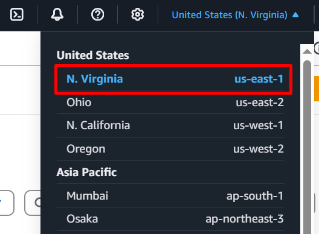

# Frontend-ToDo-App_Slack-Alerts-for-S3-Bucket-Changes


## Overview

This AWS Lab focuses on deploying a frontend Todo application using AWS CloudFront and Amazon S3, while also implementing real-time Slack alerts for S3 bucket changes using AWS EventBridge and AWS Lambda.

## Prerequisites

- Amazon Cloudfront
- Amazon S3
- AWS Lambda
- AWS Eventbridge
- Slack

## Key Components:
Frontend Todo App Deployment: The application is a static frontend hosted on an Amazon S3 bucket. AWS CloudFront is used as a CDN to serve the application globally with low latency. The deployment follows best practices, including enabling versioning and configuring proper access controls. Real-Time Slack Alerts for S3 Changes:Amazon S3 events (e.g., file uploads, deletions) trigger alerts. AWS EventBridge captures these events and routes them to an AWS Lambda function. The Lambda function processes the event and sends real-time notifications to a specified Slack channel. This setup helps monitor changes in the S3 bucket effectively.

Learning Outcomes:
Deploying and managing a static frontend app using S3 and CloudFront. Setting up EventBridge rules to capture S3 events. Writing a Lambda function to send notifications to Slack. Understanding event-driven architecture and real-time monitoring in AWS.

This lab is ideal for those looking to gain hands-on experience with serverless applications, AWS event-driven workflows, and cloud-based monitoring solutions.


## Part 1
### Step 1


### Implementation

**Select a region**

Choose **US East (N. Virginia)** region.




Go to Amazon S3


Bucket name: frontend-todo-lab-bucket


Click the create
Keep the default setting.


Go to cloudfront

Create cloudfront distribution


Distribution name: 


Choose origin access control settings


Create OAC


under Default cache behavior


Check do not enable security protections


Choose price class as Use North America, Europe, Asia, Middle East, and Africa


If have certificate, can add certificate. After that just keep as default and click create distribution


Check Cloudfront distribution and copy the S3 bucket policy.


Go to Amazon S3 and add bucket which copy from Cloudfront distribution. (Go to bucket permission)


Please check bucket policy example as below;

```json
{
        "Version": "2008-10-17",
        "Id": "PolicyForCloudFrontPrivateContent",
        "Statement": [
            {
                "Sid": "AllowCloudFrontServicePrincipal",
                "Effect": "Allow",
                "Principal": {
                    "Service": "cloudfront.amazonaws.com"
                },
                "Action": "s3:GetObject",
                "Resource": "arn:aws:s3:::frontend-todo-lab-bucket/*",
                "Condition": {
                    "StringEquals": {
                      "AWS:SourceArn": "arn:aws:cloudfront::043309344981:distribution/E37JDCFRSVYL5X"
                    }
                }
            }
        ]
      }
```


Go to IAM and user need to add user permission.


## Part 2

Setting Up EventBridge to Detect Public S3 Bucket Changes
To detect public S3 bucket changes, you need to configure AWS EventBridge to capture specific events and route them to a Lambda function for processing.


### Step 1: Create an EventBridge Rule
Run the following AWS CLI command to create an EventBridge rule that captures specific S3 events:


```json
aws events put-rule \
    --name "DetectPublicS3Changes" \
    --event-pattern '{
      "source": ["aws.s3"],
      "detail-type": ["AWS API Call via CloudTrail"],
      "detail": {
        "eventSource": ["s3.amazonaws.com"],
        "eventName": [
          "CreateBucket",
          "PutBucketAcl",
          "PutBucketPublicAccessBlock",
          "PutBucketPolicy"
        ]
      }
    }' \
    --role-arn "arn:aws:iam::<ACCOUNT_ID>:role/EventBridgeExecutionRole" \
    --region <AWS_REGION>
```


Replace <ACCOUNT_ID> with your AWS account ID. And, <AWS_REGION> with your AWS region (e.g., us-east-1).

### Step 2: Select the Target (AWS Lambda)
Run the following command to add a Lambda function as the target of the EventBridge rule:

```json
aws events put-targets \
    --rule "DetectPublicS3Changes" \
    --targets '[{
        "Id": "1",
        "Arn": "arn:aws:lambda:<AWS_REGION>:<ACCOUNT_ID>:function:<LAMBDA_FUNCTION_NAME>"
    }]'
```


### Step 3: Grant EventBridge Permission to Invoke Lambda
To allow EventBridge to trigger the Lambda function, add an invoke permission using the AWS CLI:


```bash
aws lambda add-permission \
    --function-name <FunctionName> \
    --statement-id AllowEventBridgeInvoke \
    --action lambda:InvokeFunction \
    --principal events.amazonaws.com \
    --source-arn arn:aws:events:REGION:ACCOUNT_ID:rule/<RuleName>
```


With this setup, any change in bucket permissions, ACLs, or policies will trigger an event and notify the Lambda function for further processing.

## Creating the AWS Lambda Function
To process the EventBridge events and send real-time alerts, we need to create an AWS Lambda function. Below are the steps to achieve this:

### Step 1: Create the IAM Role and Assign Permissions
1.1 Create a Trust Policy for Lambda

Create a file named trust-policy.json with the following content:

```json
{
  "Version": "2012-10-17",
  "Statement": [
    {
      "Effect": "Allow",
      "Principal": {
        "Service": "lambda.amazonaws.com"
      },
      "Action": "sts:AssumeRole"
    }
  ]
}
```

Now, create the IAM role:


```bash
aws iam create-role \
    --role-name LambdaS3MonitorRole \
    --assume-role-policy-document file://trust-policy.json
```


1.2 Create an Inline Policy for S3 Access

Create a file named s3-policy.json with the following content:


```json
{
    "Version": "2012-10-17",
    "Statement": [
        {
            "Effect": "Allow",
            "Action": [
                "s3:GetBucketAcl", 
                "s3:ListBucket", 
                "s3:GetBucketPublicAccessBlock"
            ],
            "Resource": "arn:aws:s3:::*"
        }
    ]
}
```


Attach this policy to the IAM role:


```bash
aws iam put-role-policy \
    --role-name LambdaS3MonitorRole \
    --policy-name S3MonitorPolicy \
    --policy-document file://s3-policy.json
```


1.3 Attach CloudWatch Logs Policy (for logging purposes)


```bash
aws iam attach-role-policy \
    --role-name LambdaS3MonitorRole \
    --policy-arn arn:aws:iam::aws:policy/CloudWatchLogsFullAccess
```

### Step 3: Implementing the AWS Lambda Function
Once AWS EventBridge detects changes to an S3 bucket’s permissions, it forwards the event data to an AWS Lambda function. The function processes the event and sends an alert to Slack. Below are the steps to accomplishes this:

3.1 Write the Lambda Code

Create a file named lambda_function.py with the following sample code:


```python
import json
import boto3
import requests
from botocore.exceptions import ClientError
import os

# Load Slack webhook from environment variables (Avoid hardcoding)
SLACK_WEBHOOK_URL = os.environ.get("SLACK_WEBHOOK_URL")

def lambda_handler(event, context):
    s3 = boto3.client('s3')
    event_name = event['detail']['eventName']
    bucket_name = event['detail']['requestParameters'].get('bucketName', '')
    region = event['region']
    user_identity = event['detail'].get('userIdentity', {}).get('arn', 'Unknown User')

    if not bucket_name:
        return

    # Check if bucket is public
    if event_name == "PutBucketAcl":
        if check_if_bucket_is_public(s3, bucket_name):
            message = f"🚨 S3 bucket `{bucket_name}` has a public ACL!\nRegion: {region}\nCreated by: {user_identity}"
            send_slack_notification(message)

    # Check if public access block was disabled
    elif event_name == "PutBucketPublicAccessBlock":
        if check_if_public_access_block_disabled(s3, bucket_name):
            message = f"🚨 Public access block disabled for `{bucket_name}`!\nRegion: {region}\nModified by: {user_identity}"
            send_slack_notification(message)

def check_if_bucket_is_public(s3, bucket_name):
    try:
        acl = s3.get_bucket_acl(Bucket=bucket_name)
        for grant in acl['Grants']:
            if grant['Grantee'].get('URI') == "http://acs.amazonaws.com/groups/global/AllUsers":
                return True
        return False
    except ClientError as e:
        print(f"Error checking ACL: {e}")
        return False

def check_if_public_access_block_disabled(s3, bucket_name):
    try:
        response = s3.get_public_access_block(Bucket=bucket_name)
        settings = response['PublicAccessBlockConfiguration']
        return not (settings['BlockPublicAcls'] and settings['IgnorePublicAcls'] and settings['BlockPublicPolicy'] and settings['RestrictPublicBuckets'])
    except ClientError as e:
        return e.response['Error']['Code'] == 'NoSuchPublicAccessBlockConfiguration'

def send_slack_notification(message):
    if not SLACK_WEBHOOK_URL:
        print("Slack webhook URL is not configured.")
        return
    requests.post(SLACK_WEBHOOK_URL, json={'text': message}, headers={'Content-Type': 'application/json'})
```


2.2 Package the Code

Create a ZIP package for deployment:


```bash
zip function.zip lambda_function.py
```


2.3 Retrieve the IAM Role ARN


```bash
aws iam get-role --role-name LambdaS3MonitorRole --query 'Role.Arn' --output text
```


2.4 Create the Lambda Function

Use the IAM Role ARN from the previous step in the following command:


```bash
aws lambda create-function \
    --function-name DetectPublicS3Changes \
    --runtime python3.9 \
    --role <ROLE_ARN> \
    --handler lambda_function.lambda_handler \
    --zip-file fileb://function.zip \
    --timeout 10 \
    --memory-size 128 \
    --environment Variables="{SLACK_WEBHOOK_URL=<YOUR_SLACK_WEBHOOK_URL>}"
```

Replace <ROLE_ARN> with the IAM Role ARN. And <YOUR_SLACK_WEBHOOK_URL> with the actual Slack Webhook URL.

Step 4: Grant EventBridge Permission to Invoke Lambda

```bash
aws lambda add-permission \
    --function-name DetectPublicS3Changes \
    --statement-id "EventBridgeInvokePermission" \
    --action "lambda:InvokeFunction" \
    --principal "events.amazonaws.com" \
    --source-arn "arn:aws:events:<AWS_REGION>:<ACCOUNT_ID>:rule/DetectPublicS3Changes"
```


Replace <AWS_REGION> with your AWS region. And, <ACCOUNT_ID> with your AWS account ID.

With this setup, every time a public ACL is set or public access blocking is disabled, the Lambda function will detect the change and notify your Slack channel in real-time.


Reference:

https://medium.com/@aybukeyaren4/aws-eventbridge-lambda-get-real-time-slack-alerts-for-s3-bucket-changes-d62a27a7cadd


https://github.com/smthari/Frontend-Projects/tree/master


